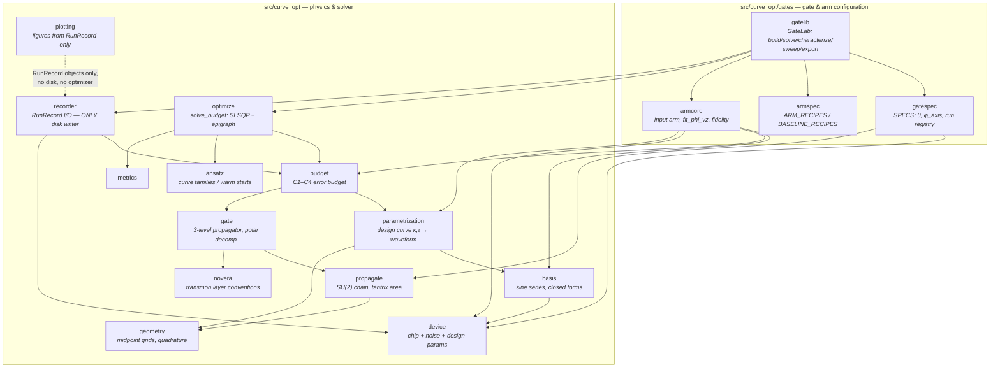
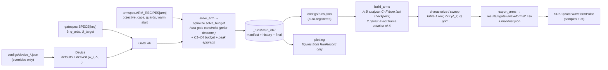

# curve-opt — error-budget pulse optimization for single-qubit gates

**In:** device parameters (JSON-overridable) + a target gate (θ, φ_axis).
**Out:** a noise-robust optimized waveform (Ω_x, Ω_y), recorded on disk with full
provenance, exportable as AWG samples.

The optimizer works on a 3D *design curve* (sine-series κ/τ) and scores it with a
physically derived **error budget** — C1 closure + C2 zero-area (quasi-static Z
noise) + C3 tantrix (amplitude error) + C4 leakage — while the target gate itself
is a **hard constraint**: the three-level qubit block's polar decomposition
`B = W·P` must satisfy `W = R_z(Φ_vz)·U_target` as a vector residual (never a
scalar `1−F̄ = 0`, whose gradient vanishes at the solution). Costs C1–C3 are
evaluated on the design curve; the gate residual, leakage and peak on the
*played* waveform after the DRAG/Stark readout layer. Physical units throughout:
T = 50 ns, Ω in rad/ns, three-level transmon with Δ = −2π·0.2 rad/ns.

This tree was extracted (F09, 2026-08-08) from the exploration repository as a
minimal, self-contained branch: no notebooks, no dev logs, no external
cross-integrator. Numerical continuity with the exploration tree is guaranteed
by the committed golden baseline (below), which the exploration tree's numbers
were captured into after they had been cross-checked against QuTiP.

## Quickstart

```bash
conda env create -f environment.yml && conda activate curve   # or: pip install -e .
python -m pytest -q                                           # test suite
python golden/check_golden.py                                 # bit-for-bit regression, ~4 min

# solve one arm of one gate (records to _runs/, registers in configs/runs.json)
python scripts/run_construction.py Xpi2 C
python scripts/run_construction.py Xpi2 C --dry-run           # manifest only

# inspect / export from Python
PYTHONPATH=src python -c "
from curve_opt.gates.gatelib import GateLab
from curve_opt.gates.gatespec import SPECS
lab = GateLab(SPECS['Xpi'])
arms = lab.build_arms()
rows = {k: lab.characterize(arms[k]) for k in lab.ARM_ORDER}
lab.export_arms(arms, rows)     # 120-pt CSVs + manifest.json under results/
"
```

## Where every parameter lives

| You want to change | Edit |
|---|---|
| Hardware (α, Ω_max, T1/T2, sample rate) | `src/curve_opt/device.py`, `hardware` group |
| Noise assumptions (δ_z, ε) — these *derive* the budget weights w_i | same file, `noise` group |
| T, M (Fourier basis size; coupled via n* = 2T\|α\| = M) | same file, `design` group |
| Target gate θ, φ_axis | `src/curve_opt/gates/gatespec.py::SPECS` |
| What an arm *is* (objective / caps / guards / grids / warm start) | `src/curve_opt/gates/armspec.py::ARM_RECIPES` |
| Gaussian+DRAG baseline shape (σ = T/6, N_fit) | same file, `BASELINE_RECIPES` |
| Which recorded run backs which arm | `configs/runs.json` (written by `run_construction.py` — data, not config) |
| A different chip / noise assumption set | a `configs/device_*.json` listing only overridden fields → `recorder.load_device()` |

Convention: **Python holds defaults and the derivation behind each number; JSON
holds only overrides and the run registry** — JSON has no room for the argument
for *why* a value is what it is.

## Architecture

Module dependency graph (arrows point at what a module imports):



End-to-end logic flow:



The six arms, per gate: **A** Gaussian (no DRAG) · **B** Gaussian+DRAG (industry
baseline, warm start) · **C** optimized 3D · **D** C + hard fluence cap ·
**E** AD-exact objective · **F** AD-robust + e0 fuse. Y(π), Y(π/2) inherit every
arm from X(π), X(π/2) by exact frame rotation (verified numerically per arm by
`covariance_check`, not assumed).

## Golden regression — the numerical contract

`golden/baseline/*.npz` freezes ~300k numbers (all `characterize()` scalars, full
noise sweeps, waveforms, coefficients, checkpoint traces, covariance checks) for
all four gates, captured on the exploration tree at extraction time.

```bash
python golden/check_golden.py          # must print: ALL BIT-FOR-BIT IDENTICAL
```

* Run it before and after **any** refactor touching `src/`. The tolerance is
  rtol=0 atol=0 — a 1e-16 drift means an expression was re-associated (the
  classic: `T/6` rewritten as `T*(1/6)` is one ulp off at T=50), not that the
  tolerance is too tight.
* This baseline **is** the independent arbiter: its numbers were cross-checked
  against QuTiP's ODE integrator while that layer existed. An intentional
  numerics change must re-baseline (`--rebase`) in the same commit that
  justifies it.
* The scipy-`expm` propagator arbiter (non-commuting case) remains live in
  `tests/test_propagate.py`.

## SDK integration notes (qeam)

Checked against the qeam snapshot of 2026-07-09 (v0.6.8); verify against the live
repo before opening an integration PR — `apis/` signatures drift.

* **Landing pad:** `qeam.pulses.WaveformPulse(samples, dt, …)` — 1-D float64/
  complex128 samples, piecewise-constant per `dt` interval. Our 120-pt export
  (`N_export = sample_rate × T = 2.4 GS/s × 50 ns`, cell-midpoint convention,
  each row constant over its dt) matches that contract directly.
* **Units at the pulse layer:** qeam times are **ns** (ours too), frequencies/
  detunings **MHz**, `axis_angle` in units of π. Our Ω is angular, rad/ns:
  convert via `f_MHz = Ω · 1000 / (2π)`. Sign convention for anharmonicity
  differs: we carry α = −0.2 rad/ns signed; qeam's `DuffingTransmonModel` takes
  `anharmonicity_max` as a **positive** MHz magnitude.
* **Units at the machine layer:** T1/T2/tphi are **µs** in `machine_config`
  (`TimeScalesModel`); our `device.py` carries ns. Factor 1000, not identity.
* **Calibration seam:** `qeam.apis.gate_calibration.drag_parameter_calibrate`
  optimizes amplitude/alpha/detuning of a `gaussian_drag` template per gate
  (`"X_0"`, `"SX_1"`). Our optimizer is a *shape* generator, not a 3-parameter
  calibrator — the natural integration is exporting `WaveformPulse` samples into
  `pulses_def` / the gate→pulse mapping rather than slotting behind that API.
* Simulation/validation belongs to the company simulator; this tree deliberately
  ships no integrator of its own (see golden contract above).

## Provenance

Extracted from the exploration repository (`Gate_construction/curve_optimize_tool`,
branch `dev/full_cost_optimizer`, F09, 2026-08-08) as an orphan branch: the
dependency closure of the full-cost-era optimizer (F01–F08), with the gate/arm
configuration layer promoted from the git-ignored `proposals/_gatelib` into
`src/curve_opt/gates/`, QuTiP removed, and the six reference runs backing
`configs/runs.json` committed under `_runs/`. Known issue carried over on
purpose (bit-exactness first): the tantrix-area C3 formula in `propagate.py`
mis-evaluates for τ≠0 designs (correct form −½∫RΩ ds); fix lands as its own
commit with a `--rebase` of the golden baseline.
